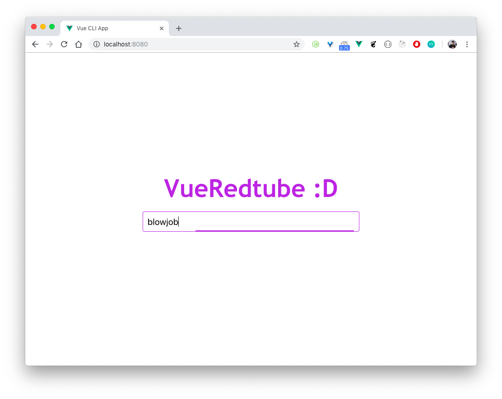
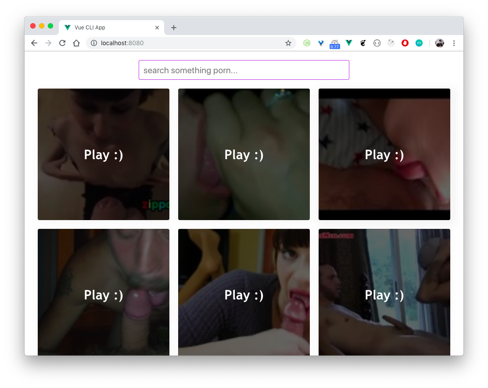

<p align="center">
  <h3 align="center">Vue Redtube</h3>
  <p align="center">Touch yourself on the Vue way</p>

  <p align="center">
  <a href="http://standardjs.com/">
    
  </a>
  </p>
</p>

---






### Usage

```sh
npm install
npm start
```
